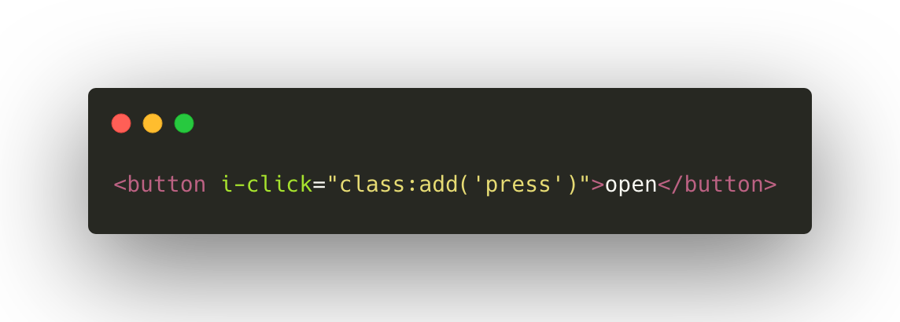
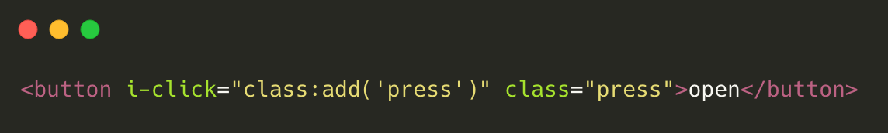
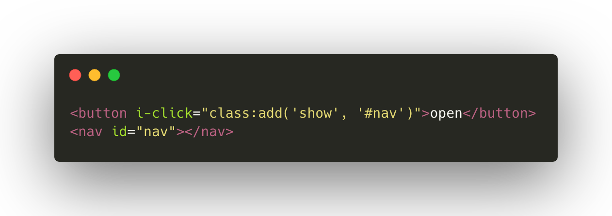
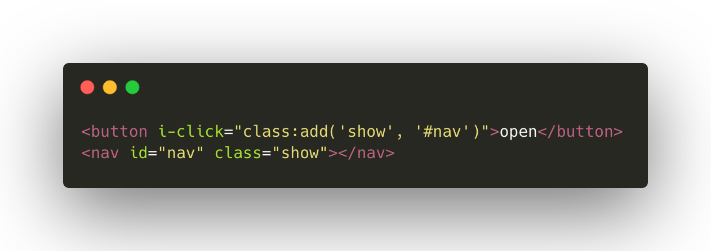
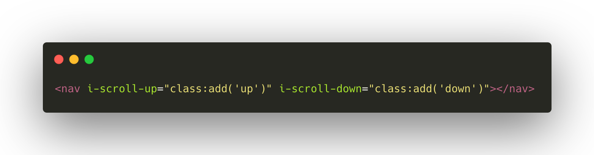
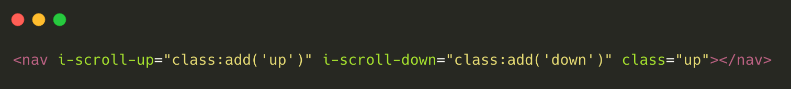
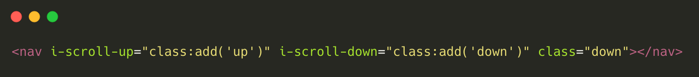

# FFNM (Front-End for the next master)

Simple utility to **avoid writing Javascript** when working with **classes**. It only takes up **1,7 Kb**!

Simplifies the click



<p align="center">
  👇👇👇👇👇👇
</p>
 


Modify others
 


<p align="center">
  👇👇👇👇👇👇
</p>
 


Simplifies the scroll



<p align="center">
  👇👇👇👇👇👇
</p>
 
Scroll up



Scroll down



## DEMOS

[Click](https://codepen.io/androsfenollosa/pen/dyGdRVE)

## Documentation

- [English](#user-content-english)
- [Spanish/Español](#user-content-spanishespañol)

---

## English

### Install

Add to your `<head>` the following tag.

```html
<script src="https://cdn.jsdelivr.net/gh/tanrax/FFNM@v1.1.0/dist/ffnm.min.js"></script>
```

### Examples

#### Click

##### Add the class `press` to `button` when the button is pressed.

```html
<button i-click="class:add('press')">open</button>
```

##### Remove the class `press` to `button` when the button is pressed.

```html
<button i-click="class:remove('press')">close</button>
```

##### Switch the classs `show` to `button` when the button is pressed.

```html
<button i-click="class:toggle('show')">view</button>
```

##### Add the class `show` to the `#nav` selector when the button is pressed.

```html
<button i-click="class:add('show', '#nav')">open</button>
<nav id="nav"></nav>
```

##### Remove the `show` class from the `#nav` selector when the button is pressed.

```html
<button i-click="class:remove('show', '#nav')">close</button>
<nav id="nav" class="show"></nav>
```

##### Switch the `show` class to the `#nav` selector when the button is pressed.

```html
<button i-click="class:toggle('show', '#nav')">view</button>
<nav id="nav" class="show"></nav>
```

#### Scroll up

##### Add the class `show` to `nav` when the scroll goes up.

```html
<nav i-scroll-up="class:add('show')"></nav>
```

##### Remove the `show` class from `nav` when the scroll goes up.

```html
<nav i-scroll-up="class:remove('show')"></nav>
```

#### Scroll down

##### Add the class `show` to `nav` when the scroll down.

```html
<nav i-scroll-down="class:add('show')"></nav>
```

##### Remove the `show` class from `nav` when the scroll down.

```html
<nav i-scroll-down="class:remove('show')"></nav>
```

---

## Spanish/Español

### Instalar

Añade a tu `<head>` la siguiente etiqueta.

```html
<script src="https://cdn.jsdelivr.net/gh/tanrax/FFNM@v1.1.0/dist/ffnm.min.js"></script>
```

### Ejemplos de uso

#### Clic

##### Añadir la clase `apretado` a `button` cuando sea pulsado.

```html
<button i-click="class:add('apretado')">Apreta</button>
```

##### Quitar la clase `apretado` a `button` cuando sea pulsado.

```html
<button i-click="class:remove('apretado')">cerrar</button>
```

##### Intercambiar la clase `apretado` a `button` cuando sea pulsado.

```html
<button i-click="class:toggle('apretado')">ver</button>
```

##### Añadir la clase `show` al selector `#menu` cuando sea pulsado el botón.

```html
<button i-click="class:add('show', '#menu')">abrir</button>
<nav id="menu"></nav>
```

##### Quitar la clase `show` al selector `#menu` cuando sea pulsado el botón.

```html
<button i-click="class:remove('show', '#menu')">cerrar</button>
<nav id="menu" class="show"></nav>
```

##### Intercambiar la clase `show` al selector `#menu` cuando sea pulsado el botón.

```html
<button i-click="class:toggle('show', '#menu')">ver</button>
<nav id="menu" class="show"></nav>
```

#### Subir scroll

##### Añadir la clase `show` al selector `nav` cuando el scroll sube.

```html
<nav i-scroll-up="class:add('show')"></nav>
```

##### Quitar la clase `show` al selector `nav` cuando el scroll sube.

```html
<nav i-scroll-up="class:remove('show')"></nav>
```

#### Bajar scroll

##### Añadir la clase `show` al selector `nav` cuando el scroll baja.

```html
<nav i-scroll-down="class:add('show')"></nav>
```

##### Quitar la clase `show` al selector `nav` cuando el scroll baja.

```html
<nav i-scroll-down="class:remove('show')"></nav>
```

---

## Development

### Install

```javascript
npm i
```

### Build

```javascript
gulp
```

### Watch mode

```javascript
gulp dev
```
